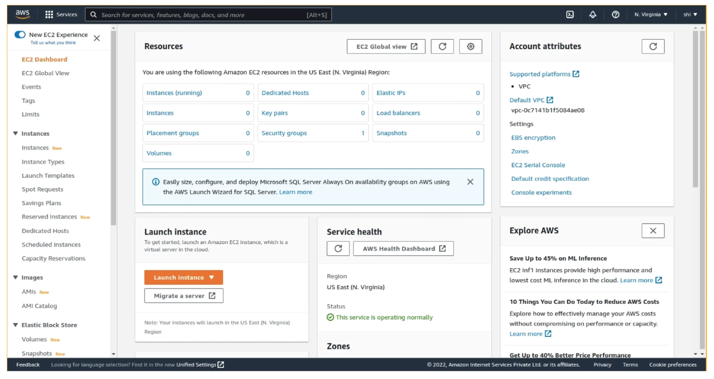

# Amazon Elastic Compute Cloud (EC2)

- **A web service that provides cloud-based computing for developers to develop and host softwares.**
- It is a service which is giving you a CPU which you can use remotely, you can choose its
  configuration (number of CPUs, memory, storage), then its OS, etc.
- **Service Type: Infrastructure as a Service (IaaS)** - as it is giving you resources.

## Features
1. ### Scalability:
  - **The ability to adjust the amount of computing resources to meet changing demands** . it is of two types
    - **Horizontal Scaling** - it has two operations
      - **Scaling Out**: Adding more instances of same type to distribute the load.
      - **Scaling In**: Reducing the number of instances when demand decreases.
    - **Vertical Scaling** - it has also two operations
      - **Scaling Up**: Increasing the size or power of existing instances.
      - **Scaling Down**: Reducing the size or power of existing instances.
  - Now Ec2 comes with Auto Scaling group which can be used to auto scale the instances based on predefined policies.
2. ### Customizability:
  - You can choose variety of things while creating an ec2 instance.
    1. **Operating System** :- various OS like Amazon Linux , Linux , Macos , Windows , Ubuntu.
    2. **Storage** :-
        - **Instance store** :- temporary storage attached to host machine
        - **Elastic Block Store (EBS)** :-
        - **Elastic File System (EFS)** :-
    3. **CPU and Memory Configuration** :- select varying number of CPU and different amounts of memory.
    4. **Instance Types** :- **T and M series** (t3.micro , m6i.large) balanced m/m , cpu , **C series** (high performance) , **R series** (high m/m)
    5. **Network Configuration** :-
3. ### Pricing Models:

## Console

## Auto Scaling Groups (ASC)
- An Auto Scaling Group is a collection of EC2 instances that are managed together as a group.
- The ASG automatically adjusts the number of instances based on predefined policies or schedules.
- If an instance fails a health check, the ASC replaces with new instance.
- Integrate your ASG with an ELB to distribute incoming traffic evenly across all instances in the ASG. This helps ensure that no single instance is overloaded.
  ### Steps to create ASC
    - set name ,Use the previously created launch configuration, set initial instances, set min and max instances that should always be running.
    - set policies , how the ASG should scale in or out based on metrics.
    - Eg : Add 3 instances at 8 AM on weekdays
    - Eg :  If average CPU utilization across instances exceeds 70% for 5 minutes, add 2 more instances.
